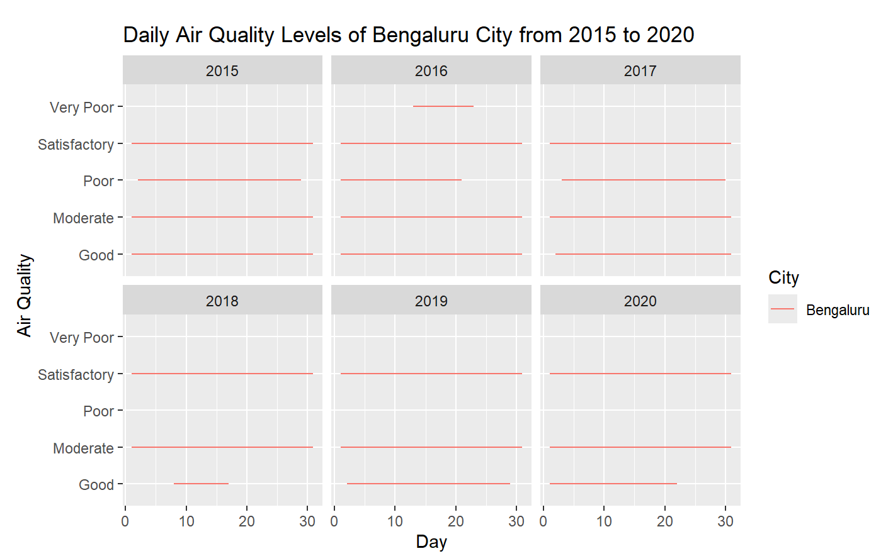

# ClimateDataAnalysisUsingR
Climate Data Analysis Using R is a comprehensive repository dedicated to exploring, analyzing, and visualizing climate data using the R programming language. 

## Features
- Data Loading and Cleaning
- Data Visualization (Bengaluru Air Quality, Chennai Air Quality, Multi-City Air Quality Comparison)
- Time Series Analysis
- Data Transformation
- Libraries Used (tidyverse, lubridate, ggplot2, forecast)

## Key Variables
- aq_day_data: Raw air quality data loaded from city_day.csv.
- clean_bglr_climate_data: Cleaned air quality data for Bengaluru.
- clean_del_climate_data: Cleaned air quality data for Delhi.
- clean_luc_climate_data: Cleaned air quality data for Lucknow.
- clean_mum_climate_data: Cleaned air quality data for Mumbai.
- clean_che_climate_data: Cleaned air quality data for Chennai.
- clean_aq_data: Combined cleaned air quality data for multiple cities.
- city_day_ts: Time series object created from the AQI column.
- city_day_decomp: Decomposed time series object showing trend, seasonality, and residuals.

## Visualizations
- Line plots for daily air quality levels in different cities.
- Faceted plots to compare air quality across years and cities.
- Time series decomposition plot to show trend, seasonality, and residuals.
- Autocorrelation Function (ACF) plot to analyze the time series dependencies.

## Installation
1. Clone the repository:
   ```sh
   git clone https://github.com/Jayaprakashsuseelam/ClimateDataAnalysisUsingR.git

## 📌 Screenshots



